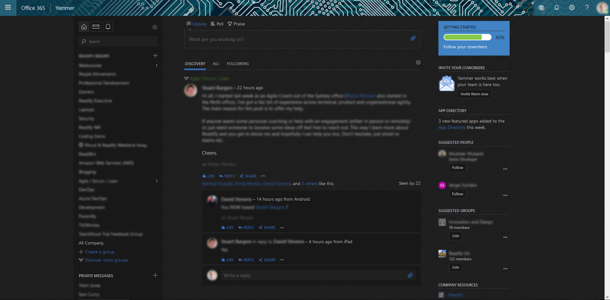

  
  
  

<h2 align="center">Your eyes will&nbsp;:heart:&nbsp;you.</h2>

## Preview

## Installation

Install [Stylus](https://add0n.com/stylus.html) for either [Firefox](https://addons.mozilla.org/en-US/firefox/addon/styl-us/), [Chrome](https://chrome.google.com/webstore/detail/stylus/clngdbkpkpeebahjckkjfobafhncgmne) or [Opera](https://addons.opera.com/en-gb/extensions/details/stylus/) and then install the style using one of these methods:

📦 [Install the usercss](https://github.com/FizzBuzz791/Yammer-Dark/raw/master/yammer-dark.user.css) which supports automatic updates. 
